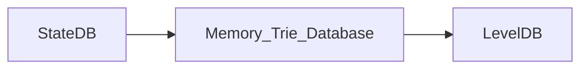

# State Management (1) : StateDB

## General

在本文中，我们剖析一下 Ethereum State 管理模块中最重要的几个数据结构，StateDB, Trie，Secure Trie，以及 StackTrie。我们将通过分析 Ethereum 中的主 workflow 的方式来深入理解这三个数据结构的使用场景，以及设计上的不同。

首先，StateDB 是这三个数据结构中最高层的封装，它是直接提供了与 StateObject (Account，Contract) 相关的 CURD 的接口给其他的模块，比如：

- Mining 模块，执行新 Blockchain 中的交易形成新的 world state。
- Block 同步模块，执行新 Blockchain 中的交易形成新的 world state，与 header 中的 state root 进行比较验证。
- EVM 中的两个与 Contract 中的持久化存储相关的两个 opcode： sStore 和 sSload.

## StateDB

我们可以在 genesis block 创建的相关代码中，找到直接相关的例子。

```go
 statedb.Commit(false)
 statedb.Database().TrieDB().Commit(root, true, nil)
```

具体 World State 的更新顺序是：



StateDB 调用 Commit 的时候并没有同时触发 TrieDB 的 Commit。

在 Block 被插入到 Blockchain 的这个 Workflow 中，stateDB 的 commit 首先在`writeBlockWithState`函数中被调用了。之后`writeBlockWithState`函数会判断 GC 的状态来决定在本次调用中，是否需要向 Disk Database 写入数据。

### From Memory to Disk

当新的 Block 被添加到 Blockchain 时，State 的数据并不一会立即被写入到 Disk Database 中。在`writeBlockWithState`函数中，函数会判断 gc 条件，只有满足一定的条件，才会在此刻调用 TrieDB 中的 Cap 或者 Commit 函数将数据写入 Disk Database 中。
