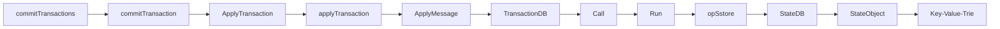

# Transaction: 一个 Transaction 的生老病死

## 概述

我们知道，Ethereum 的基本模型是基于交易的状态机模型 (Transaction-based State Machine)。在 [Account 章节](./01_account.md) 我们简述了一下 Account/Contract 的基本数据结构。本章我们就来探索一下，Ethereum 中的一个基本数据结构 Transaction。在本文中，我们提到的交易指的是在 Ethereum Layer-1 层面上构造的交易，以太坊生态中的 Layer-2 中的交易不在我们的讨论中。

首先，Transaction 是 Ethereum 执行数据操作的媒介，它主要起到下面的几个作用：

1. 在 Layer-1 网络上的 Account 之间进行 Native Token 的转账。
2. 创建新的 Contract。
3. 调用 Contract 中会修改目标 Contract 中持久化数据或者间接修改其他 Account/Contract 数据的函数。

这里我们对 Transaction 的功能性的细节再进行一些额外的补充。首先，Transaction 只能创建 Contract 账户，而不能用于创建外部账户 (EOA)。第二，如果调用 Contract 中的只读函数，是不会生成 Transaction 的。相对的，所有参与 Account/Contract 数据修改的操作都需要通过 Transaction 来进行。第三，广义上的 Transaction 只能由外部账户 (EOA) 构建。Contract 是没有办法显式构造 Layer-1 层面的交易的。在某些合约函数的执行过程中，Contract 在可以通过构造 internal transaction 来与其他的合约进行交互，但是这种 Internal transaction 与我们提到的 Layer-1 层面的交易有所不同，我们会在之后的章节介绍。

## LegacyTx & AccessListTX & DynamicFeeTx

下面我们根据源代码中的定义来了解一下 Transaction 的数据结构。Transaction 结构体的定义位于 *core/types/transaction.go* 中。Transaction 的结构体如下所示。

```go
type Transaction struct {
 inner TxData    // Consensus contents of a transaction
 time  time.Time // Time first seen locally (spam avoidance)

 // caches
 hash atomic.Value
 size atomic.Value
 from atomic.Value
}
```

从代码定义中我们可以看到，`Transaction`的结构体是非常简单的，它只包含了五个变量分别是，`TxData`类型的 inner，`Time`类型的 time，以及三个`atomic.Value`类型的 hash，size，以及 from。这里我们需要重点关注一下`inner`这个变量。目前与 Transaction 直接相关的数据都由这个变量来维护。

目前，`TxData`类型是一个接口，它的定义如下面的代码所示。

```go
type TxData interface {
 txType() byte // returns the type ID
 copy() TxData // creates a deep copy and initializes all fields

 chainID() *big.Int
 accessList() AccessList
 data() []byte
 gas() uint64
 gasPrice() *big.Int
 gasTipCap() *big.Int
 gasFeeCap() *big.Int
 value() *big.Int
 nonce() uint64
 to() *common.Address

 rawSignatureValues() (v, r, s *big.Int)
 setSignatureValues(chainID, v, r, s *big.Int)
}
```

这里注意，在目前版本的 geth 中 (1.10.*)，根据 [EIP-2718][EIP2718] 的设计，原来的 TxData 现在被声明成了一个 interface，而不是定义了具体的结构。这样的设计好处在于，后续版本的更新中可以对 Transaction 类型进行更加灵活的修改。目前，在 Ethereum 中定义了三种类型的 Transaction 来实现 TxData 这个接口。按照时间上的定义顺序来说，这三种类型的 Transaction 分别是，LegacyT，AccessListTx，TxDynamicFeeTx。LegacyTx 顾名思义，是原始的 Ethereum 的 Transaction 设计，目前市面上大部分早年关于 Ethereum Transaction 结构的文档实际上都是在描述 LegacyTx 的结构。而 AccessListTX 是基于 EIP-2930(Berlin 分叉）的 Transaction。DynamicFeeTx 是 [EIP-1559](https://eips.ethereum.org/EIPS/eip-1559)（伦敦分叉）生效之后的默认的 Transaction。

(PS: 目前 Ethereum 的黄皮书只更新到了 Berlin 分叉的内容，还没有添加 London 分叉的更新，2022.3.10)

### LegacyTx

```go
type LegacyTx struct {
 Nonce    uint64          // nonce of sender account
 GasPrice *big.Int        // wei per gas
 Gas      uint64          // gas limit
 To       *common.Address `rlp:"nil"` // nil means contract creation
 Value    *big.Int        // wei amount
 Data     []byte          // contract invocation input data
 V, R, S  *big.Int        // signature values
}
```

### AccessListTX

```go
type AccessListTx struct {
 ChainID    *big.Int        // destination chain ID
 Nonce      uint64          // nonce of sender account
 GasPrice   *big.Int        // wei per gas
 Gas        uint64          // gas limit
 To         *common.Address `rlp:"nil"` // nil means contract creation
 Value      *big.Int        // wei amount
 Data       []byte          // contract invocation input data
 AccessList AccessList      // EIP-2930 access list
 V, R, S    *big.Int        // signature values
}
```

### DynamicFeeTx

如果我们观察 DynamicFeeTx 就会发现，DynamicFeeTx 的定义其实就是在 LegacyTx/AccessListTX 的定义的基础上额外的增加了 GasTipCap 与 GasFeeCap 这两个字段。

```go
type DynamicFeeTx struct {
 ChainID    *big.Int
 Nonce      uint64
 GasTipCap  *big.Int // a.k.a. maxPriorityFeePerGas
 GasFeeCap  *big.Int // a.k.a. maxFeePerGas
 Gas        uint64
 To         *common.Address `rlp:"nil"` // nil means contract creation
 Value      *big.Int
 Data       []byte
 AccessList AccessList

 // Signature values
 V *big.Int `json:"v" gencodec:"required"`
 R *big.Int `json:"r" gencodec:"required"`
 S *big.Int `json:"s" gencodec:"required"`
}
```

## Transaction 的执行流程

Transaction 的执行主要在发生在两个 Workflow 中：

1. Miner 在打包新的 Block 时。此时 Miner 会按 Block 中 Transaction 的打包顺序来执行其中的 Transaction。
2. 其他节点添加 Block 到 Blockchain 时。当节点从网络中监听并获取到新的 Block 时，它们会执行 Block 中的 Transaction，来更新本地的 State Trie 的 Root，并与 Block Header 中的 State Trie Root 进行比较，来验证 Block 的合法性。

一条 Transaction 执行，可能会涉及到多个 Account/Contract 的值的变化，最终造成一个或多个 Account 的 State 的发生转移。在 Byzantium 分叉之前的 Geth 版本中，在每个 Transaction 执行之后，都会计算一个当前的 State Trie Root，并写入到对应的 Transaction Receipt 中。这符合以太坊黄皮书中的原始设计。即交易是使得 Ethereum 状态机发生状态状态转移的最细粒度单位。读者们可能已经来开产生疑惑了，“每个 Transaction 都会重算一个 State Trie Root”的方式岂不是会带来大量的计算（重算一次一个 MPT Path 上的所有 Node) 和读写开销（新生成的 MPT Node 是很有可能最终被持久化到 LevelDB 中的）？结论是显然的。因此在 Byzantium 分叉之后，在一个 Block 的验证周期中只会计算一次的 State Root。我们仍然可以在`state_processor.go`找寻到早年代码的痕迹。最终，一个 Block 中所有 Transaction 执行的结果使得 World State 发生状态转移。下面我们就来根据 geth 代码库中的调用关系，从 Miner 的视角来探索一个 Transaction 的生命周期。

### Native Token Transferring Transaction

### Transaction 修改 Contract 的持久化存储的

在 Ethereum 中，当 Miner 开始构造新的区块的时候，首先会启动* miner/worker.go *的 `mainLoop()`函数。具体的函数如下所示。

```go
func (w *worker) mainLoop() {
    ....
    // 设置接受该区块中挖矿奖励的账户地址
    coinbase := w.coinbase
    w.mu.RUnlock()

    txs := make(map[common.Address]types.Transactions)
    for _, tx := range ev.Txs {
        acc, _ := types.Sender(w.current.signer, tx)
        txs[acc] = append(txs[acc], tx)
    }
    // 这里看到，通过 NewTransactionsByPriceAndNonce 获取一部分的 Tx 并打包
    txset := types.NewTransactionsByPriceAndNonce(w.current.signer, txs, w.current.header.BaseFee)
    tcount := w.current.tcount
    //提交打包任务
    w.commitTransactions(txset, coinbase, nil)        
    ....
}
```

在 Mining 新区块前，Worker 首先需要决定，哪些 Transaction 会被打包到新的 Block 中。这里选取 Transaction 其实经历了两个步骤。首先，`txs`变量保存了从 Transaction Pool 中拿去到的合法的，以及准备好被打包的交易。这里举一个例子，来说明什么是**准备好被打包的交易**，比如 Alice 先后发了新三个交易到网络中，对应的 Nonce 分别是 100 和 101，102。假如 Miner 只收到了 100 和 102 号交易。那么对于此刻的 Transaction Pool 来说 Nonce 100 的交易就是**准备好被打包的交易**，交易 Nonce 是 102 需要等待 Nonce 101 的交易被确认之后才能提交。

在 Worker 会从 Transaction Pool 中拿出若干的 transaction, 赋值给 *txs* 之后，然后调用`NewTransactionsByPriceAndNonce`函数按照 Gas Price 和 Nonce 对 *txs* 进行排序，并将结果赋值给 *txset* 。此外在 Worker 的实例中，还存在`fillTransactions`函数，为了未来定制化的给 Transaction 的执行顺序进行排序。

在拿到 *txset* 之后，mainLoop 函数会调用`commitTransactions`函数，正式进入 Mining 新区块的流程。`commitTransactions`函数如下所示。

```go
func (w *worker) commitTransactions(txs *types.TransactionsByPriceAndNonce, coinbase common.Address, interrupt *int32) bool {
    ....

    // 首先给 Block 设置最大可以使用的 Gas 的上限
    gasLimit := w.current.header.GasLimit
    if w.current.gasPool == nil {
    w.current.gasPool = new(core.GasPool).AddGas(gasLimit)
    // 函数的主体是一个 For 循环
    for{
    .....
        // params.TxGas 表示了 transaction 需要的最少的 Gas 的数量
        // w.current.gasPool.Gas() 可以获取当前 block 剩余可以用的 Gas 的 Quota，如果剩余的 Gas 足以开启一个新的 Tx，那么循环结束
        if w.current.gasPool.Gas() < params.TxGas {
            log.Trace("Not enough gas for further transactions", "have", w.current.gasPool, "want", params.TxGas)break
    }
    ....
    tx := txs.Peek()
    if tx == nil {
        break
    }
    ....
    // 提交单条 Transaction 进行验证
    logs, err := w.commitTransaction(tx, coinbase)
    ....
    }
}
```

`commitTransactions`函数的主体是一个 for 循环，每次获取结构体切片头部的 txs.Peek() 的 transaction，并作为参数调用函数 miner/worker.go 的`commitTransaction()`。`commitTransaction()`函数如下所示。

```go
func (w *worker) commitTransaction(tx *types.Transaction, coinbase common.Address) ([]*types.Log, error){
    // 在每次 commitTransaction 执行前都要记录当前 StateDB 的 Snapshot, 一旦交易执行失败则基于这个 Snapshot 进行回滚。
    // TODO StateDB 如何进行快照 (Snapshot) 和回滚的
    snap := w.current.state.Snapshot()
    // 调用执行 Transaction 的函数
    receipt, err := core.ApplyTransaction(w.chainConfig, w.chain, &coinbase, w.current.gasPool, w.current.state, w.current.header, tx, &w.current.header.GasUsed, *w.chain.GetVMConfig())
    ....
}
```

Blockchain 系统中的 Transaction 和 DBMS 中的 Transaction 一样，要么完成要么失败。所以在调用执行 Transaction 的函数前，首先记录了一下当前 world state 的 Snapshot，用于交易失败时回滚操作。之后调用 core/state_processor.go/ApplyTransaction() 函数。

```go
func ApplyTransaction(config *params.ChainConfig, bc ChainContext, author *common.Address, gp *GasPool, statedb *state.StateDB, header *types.Header, tx *types.Transaction, usedGas *uint64, cfg vm.Config) (*types.Receipt, error) {
    // 将 Transaction 转化为 Message 的形式
    msg, err := tx.AsMessage(types.MakeSigner(config, header.Number), header.BaseFee)
    if err != nil {
        return nil, err
    }
    // Create a new context to be used in the EVM environment
    blockContext := NewEVMBlockContext(header, bc, author)
    vmenv := vm.NewEVM(blockContext, vm.TxContext{}, statedb, config, cfg)
    // 调用执行 Contract 的函数
    return applyTransaction(msg, config, bc, author, gp, statedb, header.Number, header.Hash(), tx, usedGas, vmenv)
}   
```

在 ApplyTransaction() 函数中首先 Transaction 会被转换成 Message 的形式。在执行每一个 Transaction 的时候，都会生成一个新的 EVM 来执行。之后调用 core/state_processor.go/applyTransaction() 函数来执行 Message。

```go
func applyTransaction(msg types.Message, config *params.ChainConfig, bc ChainContext, author *common.Address, gp *GasPool, statedb *state.StateDB, blockNumber *big.Int, blockHash common.Hash, tx *types.Transaction, usedGas *uint64, evm *vm.EVM) (*types.Receipt, error) {
    ....
    // Apply the transaction to the current state (included in the env).
    result, err := ApplyMessage(evm, msg, gp)
    ....

}
```

之后调用 core/state_transition.go/ApplyMessage() 函数。

```go
func ApplyMessage(evm *vm.EVM, msg Message, gp *GasPool) (*ExecutionResult, error) {
    return NewStateTransition(evm, msg, gp).TransitionDb()
    }   
```

之后调用 core/state_transition.go/TransitionDb() 函数。

```go
func (st *StateTransition) TransitionDb() (*ExecutionResult, error) {
    ....
    ret, st.gas, vmerr = st.evm.Call(sender, st.to(), st.data, st.gas, st.value)
    ....
}
```

之后调用 core/vm/evm.go/Call() 函数。

```go
func (evm *EVM) Call(caller ContractRef, addr common.Address, input []byte, gas uint64, value *big.Int) (ret []byte, leftOverGas uint64, err error) {
    ....
    // Execute the contract
    ret, err = evm.interpreter.Run(contract, input, false)
    ....
}
```

之后调用 core/vm/interpreter.go/Run() 函数。

```go
// Run loops and evaluates the contract's code with the given input data and returns
// the return byte-slice and an error if one occurred.
func (in *EVMInterpreter) Run(contract *Contract, input []byte, readOnly bool) (ret []byte, err error) {
    ....
    cost = operation.constantGas // For tracing
    // UseGas 函数：当前剩余的 gas quota 减去 input 参数。
    // 剩余的 gas 小于 input 直接返回 false
    // 否则当前的 gas quota 减去 input 并返回 true
    if !contract.UseGas(operation.constantGas) {
        return nil, ErrOutOfGas
        }
    ....
    // execute the operation
    res, err = operation.execute(&pc, in, callContext)
    ....

}
```

在更细粒度的层面，每个 opcode 循环调用 core/vm/jump_table.go 中的 execute 函数。这里值得一提的是，获取 Contract 中每条 Operate 的方式，是从 Contact 中的 code 数组中按照第 n 个拿取。

```go
// GetOp returns the n'th element in the contract's byte array
func (c *Contract) GetOp(n uint64) OpCode {
 return OpCode(c.GetByte(n))
}

// GetByte returns the n'th byte in the contract's byte array
func (c *Contract) GetByte(n uint64) byte {
 if n < uint64(len(c.Code)) {
  return c.Code[n]
 }

 return 0
}
```

OPCODE 的具体实现代码位于 core/vm/instructor.go 文件中。比如，对 Contract 中持久化数据修改的 OPSSTORE 指令的实现位于 opStore() 函数中。而 opStore 的函数的具体操作又是调用了 StateDB 中的 SetState 函数，将 Go-ethereum 中的几个主要的模块串联了起来。

```go
func opSstore(pc *uint64, interpreter *EVMInterpreter, scope *ScopeContext) ([]byte, error) {
    loc := scope.Stack.pop()
    val := scope.Stack.pop()
    //根据指令跟地址来修改 StateDB 中某一存储位置的值。
    interpreter.evm.StateDB.SetState(scope.Contract.Address(),loc.Bytes32(), val.Bytes32())
    return nil, nil
}

//core/state/stateDB
func (s *StateDB) SetState(addr common.Address, key, value common.Hash) {
    stateObject := s.GetOrNewStateObject(addr)
    if stateObject != nil {
    stateObject.SetState(s.db, key, value)
    }
}

对于一条调用合约函数的交易，其中必然会存在修改 StateDB 的操作。通过上述的函数调用关系，我们就完成了在一个新区块的形成过程中，Transaction 如何修改 StateDB 的 Workflow。




## [Validator] 验证节点是如何执行 Transaction 来更新 World State

而对于不参与 Mining 的节点，他们执行 Block 中 Transaction 的入口是在 core/blockchain.go 中的 InsertChain() 函数。InsertChain 函数通过调用内部函数 insertChain，对调用中的 core/state_processor.go 中的 Process() 函数。Process 函数的核心在于循环遍历 Block 中的 Transaction，调用上述的 applyTransaction 函数。从这里开始更底层的调用关系就与 Mining Workflow 中的调用关系相同。

```go
// Process processes the state changes according to the Ethereum rules by running
// the transaction messages using the statedb and applying any rewards to both
// the processor (coinbase) and any included uncles.
//
// Process returns the receipts and logs accumulated during the process and
// returns the amount of gas that was used in the process. If any of the
// transactions failed to execute due to insufficient gas it will return an error.
func (p *StateProcessor) Process(block *types.Block, statedb *state.StateDB, cfg vm.Config) (types.Receipts, []*types.Log, uint64, error) {
 var (
  receipts    types.Receipts
  usedGas     = new(uint64)
  header      = block.Header()
  blockHash   = block.Hash()
  blockNumber = block.Number()
  allLogs     []*types.Log
  gp          = new(GasPool).AddGas(block.GasLimit())
 )
 // Mutate the block and state according to any hard-fork specs
 if p.config.DAOForkSupport && p.config.DAOForkBlock != nil && p.config.DAOForkBlock.Cmp(block.Number()) == 0 {
  misc.ApplyDAOHardFork(statedb)
 }
 blockContext := NewEVMBlockContext(header, p.bc, nil)
 vmenv := vm.NewEVM(blockContext, vm.TxContext{}, statedb, p.config, cfg)
 // Iterate over and process the individual transactions
 for i, tx := range block.Transactions() {
  msg, err := tx.AsMessage(types.MakeSigner(p.config, header.Number), header.BaseFee)
  if err != nil {
   return nil, nil, 0, fmt.Errorf("could not apply tx %d [%v]: %w", i, tx.Hash().Hex(), err)
  }
  statedb.Prepare(tx.Hash(), i)
  //核心：与 Mining 中 Commit Transaction 不同，Process 在外部循环 Block 中的 Transaction 并单条执行。
  receipt, err := applyTransaction(msg, p.config, p.bc, nil, gp, statedb, blockNumber, blockHash, tx, usedGas, vmenv)
  if err != nil {
   return nil, nil, 0, fmt.Errorf("could not apply tx %d [%v]: %w", i, tx.Hash().Hex(), err)
  }
  receipts = append(receipts, receipt)
  allLogs = append(allLogs, receipt.Logs...)
 }
 // Finalize the block, applying any consensus engine specific extras (e.g. block rewards)
 p.engine.Finalize(p.bc, header, statedb, block.Transactions(), block.Uncles())

 return receipts, allLogs, *usedGas, nil
}
```

## Background of State-based Blockchain

- State-based Blockchain 的数据主要由两部分的数据管理模块组成：World State 和 Blockchain。
- State Object 是系统中基于 K-V 结构的基础数据元素。在 Ethereum 中，State Object 是 Account。
- World State 表示了 System 中所有 State Object 的最新值的一个 Snapshot，。
- Blockchain 是以块为单位的数据结构，每个块中包含了若干 Transaction。Blockchain 可以被视为历史交易数据的组合。
- Transaction 是 Blockchain System 中与承载数据更新的载体。通过 Transaction，State Object 从当前状态切换到另一个状态。
- World State 的更新是以 Block 为单位的。

1. <https://www.codenong.com/cs105936343/>
2. <https://yangzhe.me/2019/08/12/ethereum-evm/>

[EIP2718]: https://eips.ethereum.org/EIPS/eip-2718

## Read Transaction from Database

当我们想要通过 Transaction 的 Hash 查询一个 Transaction 具体的数据的时候，上层的 API 会调用`eth/api_backend.go`中的`GetTransaction()`函数，并最终调用了`core/rawdb/accessors_indexes.go`中的`ReadTransaction()`函数来查询。

```go
func (b *EthAPIBackend) GetTransaction(ctx context.Context, txHash common.Hash) (*types.Transaction, common.Hash, uint64, uint64, error) {
 tx, blockHash, blockNumber, index := rawdb.ReadTransaction(b.eth.ChainDb(), txHash)
 return tx, blockHash, blockNumber, index, nil
}
```

这里值得注意的是，在读取 Transaction 的时候，`ReadTransaction()`函数首先获取了保存该 Transaction 的函数 block body，并循环遍历该 Block Body 中获取到对应的 Transaction。这是因为，虽然 Transaction 是作为一个基本的数据结构 (Transaction Hash 可以保证 Transaction 的唯一性），但是在写入数据库的时候就是被按照 Block Body 的形式被整个的打包写入到 Database 中的。具体的可以查看`core/rawdb/accesssor_chain.go`中的`WriteBlock()`和`WriteBody()`函数。

```go
func ReadTransaction(db ethdb.Reader, hash common.Hash) (*types.Transaction, common.Hash, uint64, uint64) {
 blockNumber := ReadTxLookupEntry(db, hash)
 if blockNumber == nil {
  return nil, common.Hash{}, 0, 0
 }
 blockHash := ReadCanonicalHash(db, *blockNumber)
 if blockHash == (common.Hash{}) {
  return nil, common.Hash{}, 0, 0
 }
 body := ReadBody(db, blockHash, *blockNumber)
 if body == nil {
  log.Error("Transaction referenced missing", "number", *blockNumber, "hash", blockHash)
  return nil, common.Hash{}, 0, 0
 }
 for txIndex, tx := range body.Transactions {
  if tx.Hash() == hash {
   return tx, blockHash, *blockNumber, uint64(txIndex)
  }
 }
 log.Error("Transaction not found", "number", *blockNumber, "hash", blockHash, "txhash", hash)
 return nil, common.Hash{}, 0, 0
}
```

## Terms

- Externally Owned Account(EOA) 外部账户。
